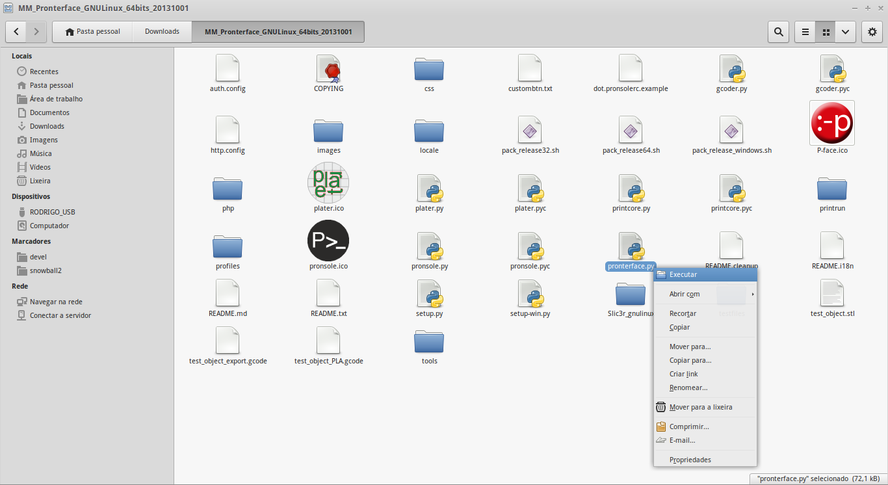
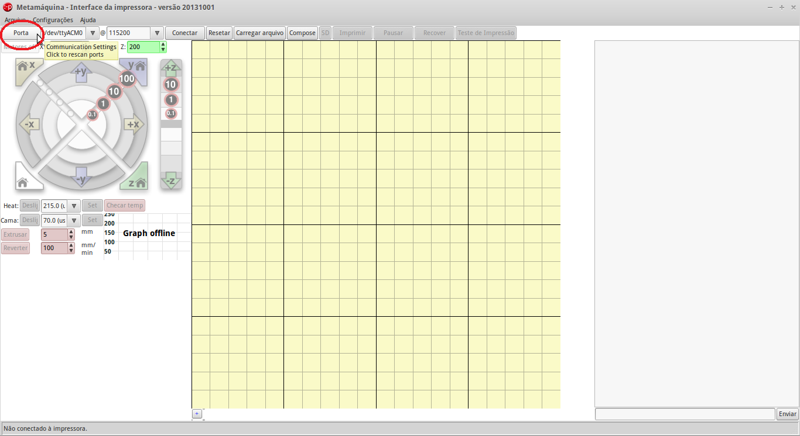
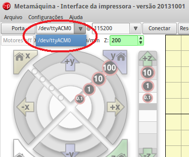
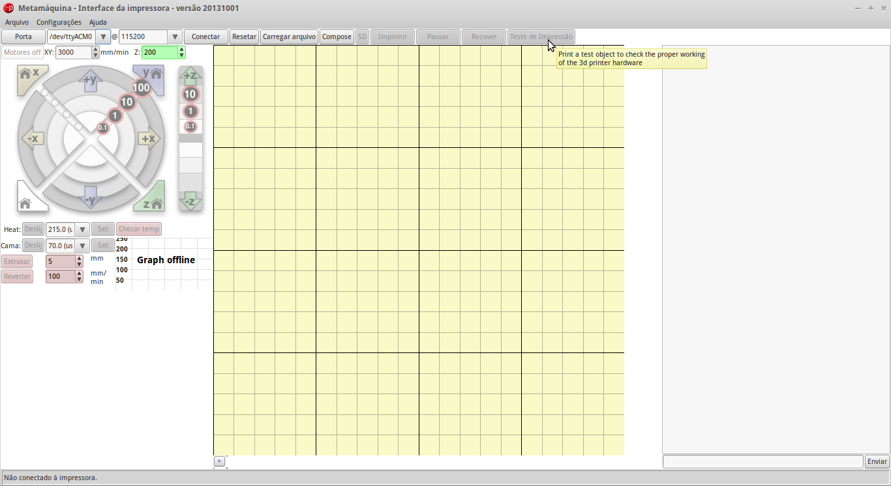

# Módulo 01
## manufatura e prototipação rápida

-----

Quando falamos de impressão 3D, todos ficam imediatamente fascinados com o funcionamento da máquina. Afinal, como um objeto, que só está desenhado ali no computador, aos poucos vai surgindo e tomando forma material, sem nenhum tipo de molde ou ferramenta especial?

Existem diversas tecnologias de impressão 3D, com modos de funcionamento e materiais específicos, mas sempre com algo em comum: o conceito de **manufatura aditiva**. Mas vamos deixar isso para depois! O funcionamento da máquina pode ser complexo, e por isso vamos aprendendo aos poucos. Sabemos que você está cheio de dúvidas e curiosidade, mas as respostas virão no tempo certo!

-----

### Conceito

Ao contrário do que pode parecer, a impressão 3D não é novidade, ao menos nos meios técnicos e científicos. Ela está por aí desde a década de 80. A impressão 3D foi criada no contexto da indústria, em uma época em que praticamente não havia máquinas de manufatura controladas por computador (CNC).

Na indústria de massa, em que muitas unidades do mesmo produto são fabricadas, geralmente é necessário que se faça um enorme investimento em ferramentas específicas para a fabricação de cada peça, os moldes de injeção, entre outras peças.

Isso quer dizer que é preciso ter segurança e certeza sobre um projeto antes de começar a instalar a fábrica que vai produzi-lo. Para isso, em várias etapas do projeto de um produto são criados **protótipos**. Protótipos são como maquetes, só que, na maioria dos casos, em tamanho real.

Antes das impressoras 3D, criar um protótipo era um processo caro e demorado, feito apenas por profissionais muito qualificados que, a partir dos desenhos técnicos, faziam um protótipo de um produto à mão. Com as impressoras 3D, esse passo é eliminado, e a fabricação de um protótipo pode ser feita diretamente do computador, a partir de um **modelo 3D** (falaremos sobre isso nos próximos módulos).

-----

### Técnica

Neste módulo, vamos aprender sobre o funcionamento básico de uma impressora 3D e como fazer para imprimir uma peça que já foi desenhada anteriormente. Nos próximos módulos, aprenderemos mais sobre a calibração e manutenção da máquina, como instalar o filamento, além de técnicas avançadas como ajuste na qualidade de impressão e formatos de preenchimento.

Vamos começar assistindo ao vídeo abaixo, em que explicamos os primeiros passos para o uso da máquina:

<iframe width="640" height="360" src="//www.youtube.com/embed/DWJ8orajp8w" frameborder="0" allowfullscreen></iframe>

Bom, parece fácil, não é? Agora vamos fazer isso nós mesmos!

Para tornar o processo mais rápido e saciar a curiosidade de todos, vamos pular algumas etapas iniciais do processo e cada máquina já estará previamente calibrada e com o filamento instalado. Mas fique tranquilo: nos próximos módulos voltaremos a esses pontos e faremos todo o processo passo-a-passo, desde o início.

-----

### Aplicação

#### Software

Para comandar a impressora 3D *Metamáquina 2*, vamos usar um software chamado [Pronterface](https://pronterface.com), especificamente uma [versão customizada](http://metamaquina.com.br/documentacao/documentacao-instalando-o-software) pela Metamáquina.

O Pronterface é um [software livre](https://www.gnu.org/philosophy/free-sw.pt-br.html) que funciona como uma espécie de painel de controle ou *driver* da máquina. Isto quer dizer que ele não é capaz de *criar* objetos, apenas carregá-lo na máquina e dar início à impressão. Ao longo deste curso, veremos outros softwares como o Pronterface (chamados genericamente de *host*, ou hospedeiro), além de apresentar softwares em que os modelos podem ser criados.
 
O Pronterface já está instalado na sua máquina. Para abri-lo, clique com o botão direito no arquivo `pronterface.py`, que está na pasta `MM_Pronterface` da sua área de trabalho, e depois em `Executar`.

#### Conectando a máquina

Com o software aberto e a máquina preparada, você precisará de apenas alguns cliques para começar a imprimir.

Clique em `Port` e então `Connect`.

Caso ele não consiga conectar, tente outra porta no menu de seleção `Port`.

Quando a Metamáquina conectar ela automaticamente irá inicar o procedimento de *homing*. Esse é o processo pelo qual a máquina se auto-calibra em relação aos eixos X (onde está o extrusor) e Y (onde está a plataforma de impressão). Esse processo leva alguns segundos.

Uma vez terminado o processo, a Metamáquina irá parar em sua posição de descanso, com a cabeça de extrusão em um dos cantos da superfície de impressão.

A Metamáquina já sai de fábrica testada e com a altura do Z calibrada. No entanto, você pode repetir o processo de calibração (descrito nos módulos seguintes) caso queira ou sinta necessidade. Na dúvida, peça ajuda ao seu instrutor.

#### Impressão da peça teste

O Pronterface inclui um botão de “impressão de peça teste”. A peça é apenas um chaveiro personalizado, como pode-se ver na imagem acima. Certifique-se que sua impressora está devidamente ligada, conectada e com o filamento instalado, e então clique em no botão `Teste de impressão` no topo da janela. Em menos de 15 minutos você terã em mãos a sua primeira peça feita na impressora 3D!

Bom, por enquanto é isso, pessoal! Nos vemos novamente para o Módulo 02!